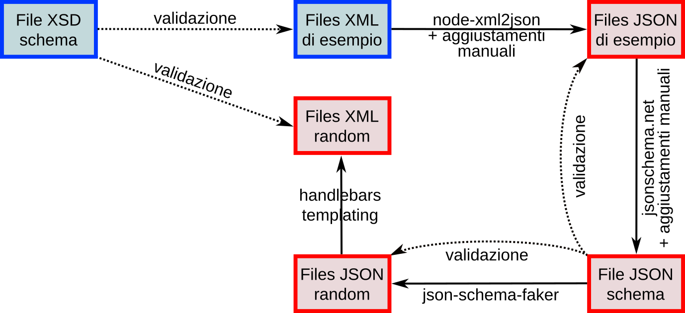

# Rappresentazione JSON per le fatture elettroniche

**Proof-of-concept** per una rappresentazione in formato JSON delle fatture elettroniche secondo la normativa italiana ("fatturaPA").

## Scopo

Le fatture elettroniche vengono trasmesse ed archiviate in formato **XML**.

La documentazione tecnica di riferimento del **formato XML** delle fatture elettroniche è disponibile al seguente url: https://www.fatturapa.gov.it/it/norme-e-regole/documentazione-fatturapa/

Poiché per lo sviluppo di API ed SDK è più comodo manipolare i dati in formato **JSON**, questo proof-of-concept mira a valutare la fattibilità di:
- **convertire** XML <-> JSON
- **validare** JSON
- **generare** file fattura JSON e XML **randomizzati** a scopo di test e fuzzy-test
- **rapid prototyping** di visualizzatori ed editor
- persistenza in **database** SQL e No-SQL.

## Prerequisiti

```
sudo apt install make nodejs yarnpkg php-cli libxml2-utils composer phpunit shellcheck
yarnpkg install
composer install
```

## Procedura

La procedura seguita per il proof-of-concept è rappresentata nel seguente flow-chart (in blu i files tratti dal sito `fatturapa.gov.it`, in rosso quelli generati in questo progetto):



Innanzitutto lo [schema XML (*XSD**)](https://en.wikipedia.org/wiki/XML_Schema_(W3C)) della fattura elettronica tratto dal sito `fatturapa.gov.it` ([`Schema del file xml FatturaPA versione 1.2.1a.xsd`](Schema del file xml FatturaPA versione 1.2.1a.xsd)) è stato trasformato in una versione ([`Schema_del_file_xml_FatturaPA_versione_1.2.1a_cleanup.xsd`](Schema_del_file_xml_FatturaPA_versione_1..1_cleanup.xsd)) normalizzata (fromdos, xmllint, 2-space indent) e che importa una [copia locale dello schema `xmldsig`](xmldsig-core-schema.xsd):
```
3c3,4
<   <xs:import namespace="http://www.w3.org/2000/09/xmldsig#" schemaLocation="http://www.w3.org/TR/2002/REC-xmldsig-core-20020212/xmldsig-core-schema.xsd"/>
---
>   <xs:import namespace="http://www.w3.org/2000/09/xmldsig#" schemaLocation="xmldsig-core-schema.xsd"/>
> 
```

Le fatture in formato JSON possono essere validate per mezzo di un **JSON schema** (vedi [paragrafo Riferimenti](#riferimenti)), anche se quest'ultimo è più limitato dello schema XML, alcuni vincoli dovranno essere validati dall'applicazione, ad esempio:

- limitazioni ai **set di caratteri ammessi**: ad esempio il campo `FatturaElettronica.FatturaElettronicaHeader.DatiTrasmissione.ProgressivoInvio` secondo lo schema XML è vincolato al tipo `String10Type` così definito:
    ```
    <xs:simpleType name="String10Type">
      <xs:restriction base="xs:normalizedString">
        <xs:pattern value="(\p{IsBasicLatin}{1,10})"/>
      </xs:restriction>
    </xs:simpleType>
    ```
  che accetta da 1 a 10 caratteri del [blocco Unicode Basic Latin](https://www.w3.org/TR/xsd-unicode-blocknames/), mentre lo schema JSON accetta qualunque stringa di lunghezza compresa tra 1 e 10 caratteri:
    ```
    "ProgressivoInvio": {
      "type": "string",
      "minLength": 1,
      "maxLength": 10,
    ```
- **alternative**: ad esempio il tipo `AnagraficaType` usato per i campi:
  - `FatturaElettronica.FatturaElettronicaHeader.CedentePrestatore.DatiAnagrafici.Anagrafica`,
  - `FatturaElettronica.FatturaElettronicaBody[].DatiTrasporto.DatiAnagraficiVettore.Anagrafica`
  - `FatturaElettronica.FatturaElettronicaHeader.RappresentanteFiscale.DatiAnagraficiRappresentante.Anagrafica`
  - `FatturaElettronica.FatturaElettronicaHeader.CessionarioCommittente.DatiAnagraficiCessionario.Anagrafica`
  - `FatturaElettronica.FatturaElettronicaHeader.TerzoIntermediarioOSoggettoEmittente.DatiAnagraficiTerzoIntermediario.Anagrafica`

  contiene un campo `Denominazione` che è in alternativa a `Nome` + `Cognome`; non vi è modo di esprimere questo tipo di vincolo in JSON schema.

Inizialmente si è tentato di convertire lo schema XSD in uno [schema JSON](http://json-schema.org/) usando la libreria [jgeXml](https://github.com/Mermade/jgeXml):
```
nodejs ./node_modules/jgexml/testxsd2j.js Schema del file xml FatturaPA versione 1.2.1a.xsd  > fatturaPA_1.2.1a_schema.json
```
ottenendo però uno schema non utilizzabile.

Successivamente i files XML di esempio sono stati convertiti a JSON per mezzo della libreria javascript [node-xml2json](https://github.com/buglabs/node-xml2json) (script [`bin/convert_samples.sh`](bin/convert_samples.sh)).

La liberia xml2json [non è supportata nel browser](https://github.com/buglabs/node-xml2json/issues/97). Nel browser si può usare invece a libreria più semplice [x2js](https://github.com/Axinom/x2js), vedi lo script `bin/xml2json_x2js.js`.

Oppure la conversione si può fare server-side con lo script PHP [`www/xml2json.php`](www/xml2json.php), ad esempio:
```
curl -X POST -F 'xml=@samples/IT01234567890_FPA01.xml' http://localhost:8000/xml2json.php
```

Si è quindi generato uno schema a partire dai files fattura JSON di esempio, per mezzo del servizio on-line [jsonschema.net](https://www.jsonschema.net/), che dopo semplificazione (`grep -v '$id'`) e aggiustamento manuale aggiunta di campi `title` e `description` desunti dalle SPECIFICHE TECNICHE OPERATIVE DEL FORMATO DELLA FATTURA DEL SISTEMA DI INTERSCAMBIO ha dato origine allo schema [`fatturaPA_1.2_schema.json`](fatturaPA_1.2_schema.json).

La generazione di files XML random a scopo di test è possibile con alcuni strumenti commerciali, ad esempio:
- https://msdn.microsoft.com/en-us/library/aa302296.aspx "Generating XML Documents from XML Schemas" Priya Lakshminarayanan, Microsoft Corporation - August 2004
- https://msdn.microsoft.com/en-us/library/dd489258.aspx "How to: Create an XML Document Based on an XSD Schema Visual Studio 2015"
- https://msdn.microsoft.com/en-us/library/cc716766.aspx "XML Schema Explorer"

In questo proof-of-concept si è scelto di generare dei files JSON random partendo dallo schema JSON per mezzo di [json-schema-faker](https://github.com/json-schema-faker/json-schema-faker), e di riconvertirli a XML per mezzo del template [handlebars](http://handlebarsjs.com/) [`fatturaPA_1.2.hbs`](fatturaPA_1.2.hbs) (script [`bin/generate_random.sh`](bin/generate_random.sh)).

## Contributing

Check your changes with:
```
# lint javascript
./node_modules/jshint/bin/jshint --extract=auto www/index.html
./node_modules/jshint/bin/jshint bin/*.js
# lint shell scripts
shellcheck bin/*.sh
# lint PHP
./vendor/bin/phpcs --standard=PSR2 tests/*.php
./vendor/bin/phpcs --standard=PSR2 www/*.php
./vendor/bin/phpcs --standard=PSR2 bin/*.php
```

You **must** use the [git-flow workflow](https://danielkummer.github.io/git-flow-cheatsheet/)

## Test

I files XML di esempio tratti dal sito `fatturapa.gov.it` sono stati validati con lo schema XML modificato (script [`bin/validate_samples_xml.sh`](bin/validate_samples_xml.sh)).

Tutti i files di esempio XML convertiti a JSON per mezzo della libreria javascript node-xml2json sono stati validati con lo schema JSON sia col validatore javascript che col validatore PHP (script [`bin/validate_samples_json.sh`](bin/validate_samples_json.sh)).

Test della classe PHP `Xml2Json`:
```
phpunit --testdox tests
```

Il template handlebars è stato validato riconvertendo ad XML i files di esempio (script [`bin/reconvert_samples.sh`](bin/reconvert_samples.sh)).

## Demo

Con lo schema così ottenuto e [JSON Editor](https://github.com/json-editor/json-editor) è possibile generare automaticamente un editor basico.

Per lanciare il demo:
```
make
php -S localhost:8000 -t www
```
quindi visitare http://localhost:8000/index.html

## Legalese

Copyright (c) 2018, Paolo Greppi <paolo.greppi@simevo.com>

Licenza: BSD 3-Clause, vedi file [`LICENSE`](LICENSE).

## Riferimenti

- https://jsonlint.com/

- http://json-schema.org/

- https://spacetelescope.github.io/understanding-json-schema/reference/index.html

- https://jsonschemalint.com/#/version/draft-06/markup/json
